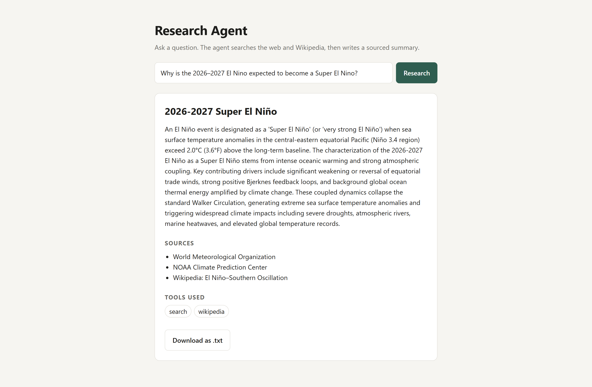

# Research Agent

An AI research assistant built with **LangChain** and **Google Gemini**. Ask it a question and it searches the web and Wikipedia, then writes a concise summary with the sources it relied on.

It comes with a small web UI (FastAPI) and a command-line version.

### 🚀 Live Demo

👉 **[Try the AI Research Agent](https://python-ai-agent-lake.vercel.app/)**



## Features

- **Tool-using agent** – decides on its own when to search the web (DuckDuckGo) or look up Wikipedia
- **Structured output** – every answer comes back as a topic, summary, list of sources, and the tools that were actually called
- **Model fallback** – if one Gemini model hits its free-tier quota or is overloaded, the agent falls through to the next one
- **Web UI** – single-page interface with a "Download as .txt" button
- **CLI** – same agent in the terminal, with the option to save results to `research_output.txt`
- **Graceful failures** – a tool that is down is reported back to the model instead of crashing the request

## Tech stack

| Layer    | Used                                                  |
| -------- | ----------------------------------------------------- |
| Agent    | LangChain (`create_agent`, `ModelFallbackMiddleware`) |
| LLM      | Google Gemini via `langchain-google-genai`            |
| Tools    | DuckDuckGo search (`ddgs`), Wikipedia                 |
| API      | FastAPI + Uvicorn                                     |
| Frontend | Plain HTML / CSS / JavaScript                         |

<!-- ## Getting started

### 1. Clone and install

```bash
git clone https://github.com/<your-username>/<your-repo>.git
cd <your-repo>

python -m venv .venv
.venv\Scripts\activate        # Windows
# source .venv/bin/activate   # macOS / Linux

pip install -r requirements.txt
```

### 2. Add your API key

Get a free Gemini API key from [Google AI Studio](https://aistudio.google.com/apikey), then create a `.env` file in the project root:

```env
GOOGLE_API_KEY=your-key
```

Optionally choose which models to use, in order of preference:

```env
GEMINI_MODELS=gemini-3.8-flash,gemini-3.6-flash,gemini-3.5-flash,gemini-3.5-flash-lite
```

### 3. Run

**Web UI** – then open http://127.0.0.1:8000

```bash
python -m uvicorn app:app --reload
```

**Command line**

```bash
python main.py
```

## API

`POST /api/research`

```json
{ "query": "how rainbow is formed" }
```

Response:

```json
{
  "topic": "How rainbows are formed",
  "summary": "A rainbow is an optical phenomenon that ...",
  "sources": ["https://en.wikipedia.org/wiki/Rainbow"],
  "tools_used": ["wikipedia"]
}
```

`query` must be 3–500 characters. The endpoint returns `429` when the Gemini quota is used up and `502` if the agent fails for any other reason.

Interactive API docs are available at http://127.0.0.1:8000/docs while the server is running. -->

<!-- ## Project structure

```
.
├── agent.py           # Agent setup, model fallback, structured response
├── tools.py           # Web search, Wikipedia and save-to-file tools
├── app.py             # FastAPI app (serves the UI and /api/research)
├── main.py            # Command-line entry point
├── static/
│   └── index.html     # Web UI
├── requirements.txt
└── screenshot.png
```

## Deploy to Vercel

1. Push this folder to a GitHub repo (`.env` is git-ignored, so your key stays local).
2. Import the repo at [vercel.com/new](https://vercel.com/new). Vercel detects the FastAPI `app` in `app.py`.
3. Add `GOOGLE_API_KEY` under **Project Settings → Environment Variables**, then deploy. -->
